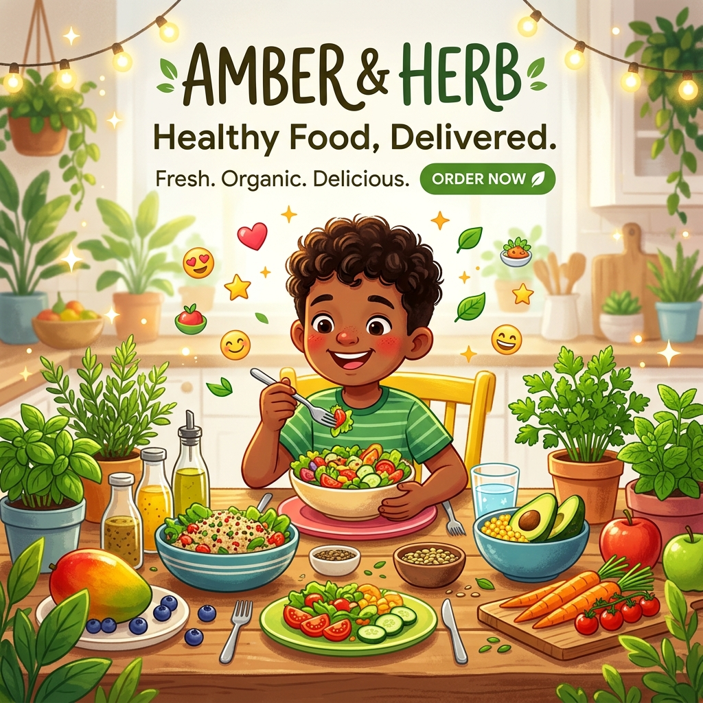
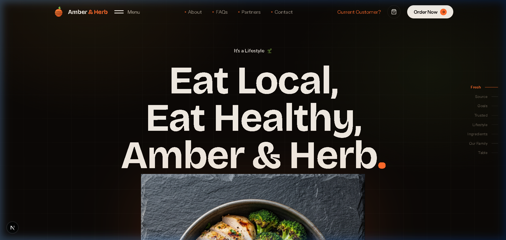
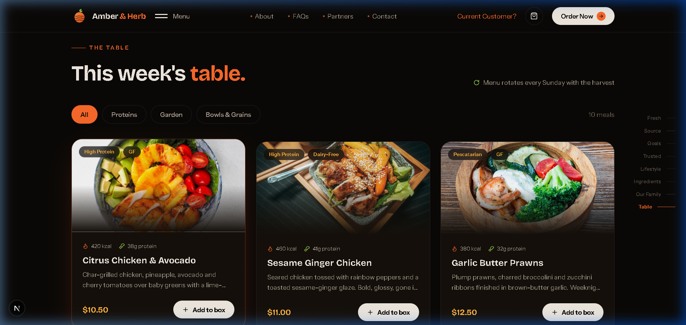
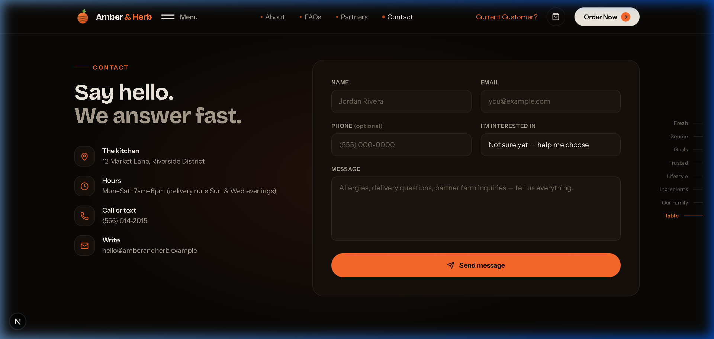
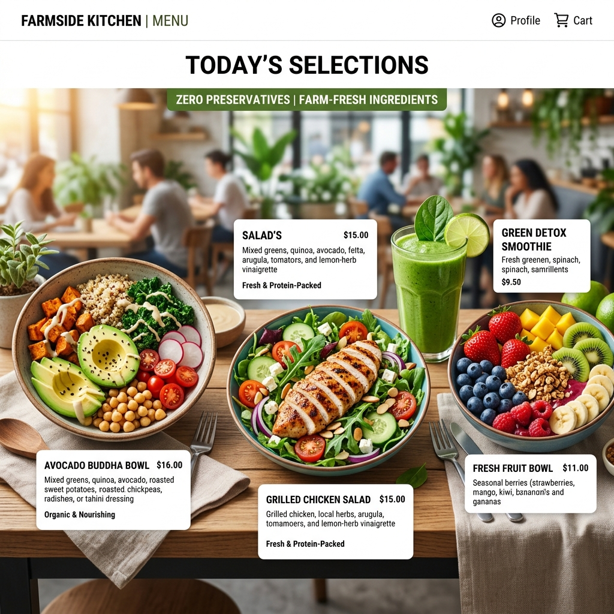

# 🌿 Amber & Herb — Eat Local, Eat Healthy 🥗✨



<div align="center">

[](https://nextjs.org/)
[](https://www.typescriptlang.org/)
[](https://tailwindcss.com/)
[](https://orm.drizzle.team/)
[](./LICENSE)
[](https://github.com/SriniwasAwasthi/Amber-and-Herb)

**An Online Food Court & Doorstep Delivery Platform delivering 100% organic, zero-preservative meals straight from local farms to your home in 48 hours! 🛵💨**

[🌐 View Live Screenshots](#-real-website-live-screenshots) • [🧩 Components Overview](#-components--stuff-inside) • [🚀 Installation Guide](#-how-to-install--run-locally) • [💖 Thank You](#-a-special-thank-you-)

</div>

---

## 📸 Real Website Live Screenshots 🖥️✨

### 🏠 1. Live Hero Section


### 🥗 2. Live Interactive Menu ("This Week's Table")


### 📬 3. Live Contact & Order Inquiries Form


---

## 📌 What is Amber & Herb? 🍕🥗

**Amber & Herb** is a modern, full-stack online food court and delivery platform. It bridges the gap between **local organic farmers** and **healthy food lovers**. 

Unlike conventional fast-food delivery apps, Amber & Herb focuses on **100% natural, farm-fresh ingredients with zero artificial preservatives**. Users can easily browse through categorized food menus, explore healthy meal bowls, learn about organic farming origins, and get wholesome meals delivered to their doorstep in under **48 hours**! 🚚📦


---

## 💡 Why This Website is Used (Purpose & Core Mission) 🎯

1. 🚫🧪 **Eliminating Preservatives:** Providing pure, chemical-free food to protect health and immunity.
2. 👩‍🌾 **Supporting Local Farmers:** Sourcing raw ingredients directly from registered regional farms to promote local agriculture.
3. ⏱️ **Fast 48-Hour Delivery:** Guaranteeing peak freshness from harvest to kitchen to table.
4. 🥗 **Transparent Nutrition:** Every menu item lists clean ingredients, calorie breakdowns, and dietary tags (Vegan, High Protein, Gluten-Free).

---

## 👥 Why Amber & Herb is Helpful for Everyone 🎓💼


### 🎒 1. For Students & Young Learners
- 🧠 **Brain-Boosting Meals:** Helps students choose nutritious study snacks (fresh smoothies, fruit bowls, protein salads) to stay alert during exams.
- 💰 **Budget Friendly:** Offers combo options and accessible meal pricing tailored for student budgets.
- 💻 **Open-Source Learning:** Serves as a real-world code tutorial for learning Next.js 15, TypeScript, Tailwind CSS, and SQLite database management.

### 💼 2. For Developers, Recruiters & Tech Interviewers
- ⚡ **Modern Stack:** Demonstrates clean architecture using Next.js App Router, Server Components, dynamic seeding, and Drizzle ORM.
- 🎨 **Visual Excellence:** High-end UI aesthetics featuring glassmorphism, responsive marquee banners, and atomic component architecture.


### 👵 3. For Families & Senior Citizens
- 🥬 **Easy Digestion:** Low-salt, soft, preservative-free ingredients suitable for older adults and children.
- 🔍 **Accessible UI:** High-contrast typography and intuitive navigation.

---

## ⚙️ Why This Method & Architecture is Used 🏛️

Amber & Herb is engineered for **speed, scalability, and maintainability**:

- 🚀 **Next.js 15 (App Router & Server Components):** Renders pages on the server for lightning-fast initial load times and superior SEO rankings.
- 📘 **TypeScript:** Enforces strict type safety across database schemas, API responses, and UI props to prevent runtime errors.
- 🗄️ **Drizzle ORM & SQLite / Better-SQLite3:** Lightweight, zero-overhead database interaction for seeding and fetching meals and FAQs instantly.
- 🎨 **Tailwind CSS & Utility-First Styling:** Ensures rapid UI customization with a uniform color palette and responsive layout breakpoints.

---

## 🧩 Components & Stuff Contained in the Website 📦



The application is structured into reusable, modular React components:

| Component Name | File Path | Description |
| :--- | :--- | :--- |
| 🧭 **Nav** | [`src/components/Nav.tsx`](./src/components/Nav.tsx) | Sticky navigation bar with brand branding, links, and order CTA button. |
| 🚀 **Hero** | [`src/components/Hero.tsx`](./src/components/Hero.tsx) | High-impact hero section showcasing `hero-bowl.png` image and main tagline. |
| 📜 **Marquee** | [`src/components/box.tsx`](./src/components/box.tsx) | Continuous scrolling ticker featuring live slogans ("Eat Local", "Zero Preservatives"). |
| 🥗 **MenuSection** | [`src/components/MenuSection.tsx`](./src/components/MenuSection.tsx) | Interactive meal catalog displaying food categories, prices, and ingredient tags. |
| 🥦 **Fresh & Source** | [`src/components/Sections.tsx`](./src/components/Sections.tsx) | Illustrates fresh farm sourcing and soil quality standards. |
| 🎯 **Goals & Lifestyle** | [`src/components/Sections.tsx`](./src/components/Sections.tsx) | Highlights nutritional targets and healthy lifestyle habits. |
| 🛡️ **Trusted & Family** | [`src/components/Sections.tsx`](./src/components/Sections.tsx) | Displays customer trust stats and family meal packages. |
| 🤝 **Partners** | [`src/components/Sections.tsx`](./src/components/Sections.tsx) | Displays logos and badges of certified local partner farms. |
| ❓ **FaqContact** | [`src/components/FaqContact.tsx`](./src/components/FaqContact.tsx) | Dynamic expandable FAQs section and interactive contact form. |
| 🦶 **Footer** | [`src/components/FaqContact.tsx`](./src/components/FaqContact.tsx) | Footer navigation links, copyright, and social media icons. |

---

## 🚀 How to Install & Run Locally 🛠️

Follow these quick steps to get Amber & Herb running on your machine:

### 📋 Prerequisites
Make sure you have the following installed on your system:
- **Node.js** (v18.0.0 or higher)
- **npm** (v9.0.0 or higher) or **pnpm** / **yarn**
- **Git**

### 1️⃣ Clone the Repository
```bash
git clone https://github.com/SriniwasAwasthi/Amber-and-Herb.git
cd Amber-and-Herb
```

### 2️⃣ Install Dependencies
```bash
npm install
```

### 3️⃣ Set Up & Seed Database
Initialize and seed the SQLite database with fresh meals and FAQs:
```bash
npm run db:push
```

### 4️⃣ Start Development Server
```bash
npm run dev
```

### 5️⃣ Open in Browser
Open your browser and navigate to:
```text
http://localhost:3000
```

---

## 🛠️ Tech Stack at a Glance ⚡

```text
├── Framework    : Next.js 15 (App Router)
├── Language     : TypeScript
├── Styling      : Tailwind CSS + PostCSS
├── Database     : SQLite / Better-SQLite3
├── ORM          : Drizzle ORM
├── Components   : React Server Components (RSC) + Lucide Icons
```

---

## 💖 A Special Thank You! 🌿✨

Thank you so much for dropping by and spending your precious time exploring my profile and projects! 💖  
It truly means the world to me that you took a moment out of your day to read through my work and journey. 🌿✨  

I hope you found something here that inspired you or brought a smile to your face! 🚀  
Building and learning is a journey I cherish, and knowing you took the time to read through it makes it all the more special. 💫  

🌈 **If you enjoyed what you saw, feel free to connect or leave a star ⭐️**  
Wishing you endless success and brightness in everything you do! 🚀✨ Have a fantastic day ahead! 💖🚀

---

<div align="center">

Made with ❤️ by [Sriniwas Awasthi](https://github.com/SriniwasAwasthi) • **Amber & Herb © 2026**

</div>
